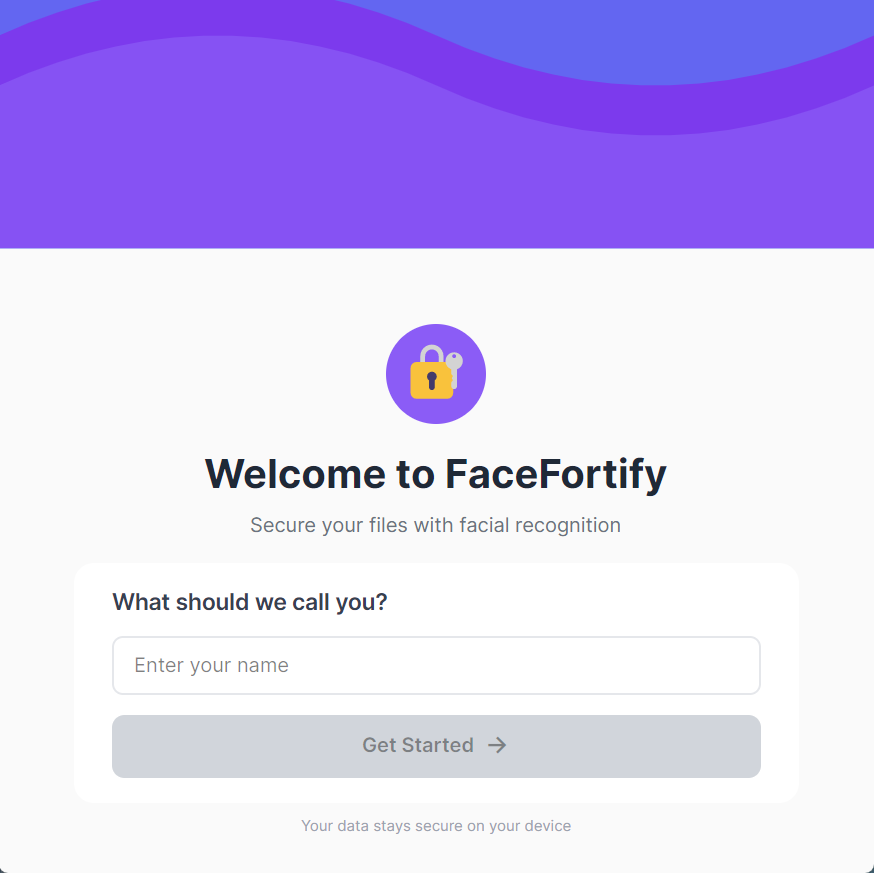
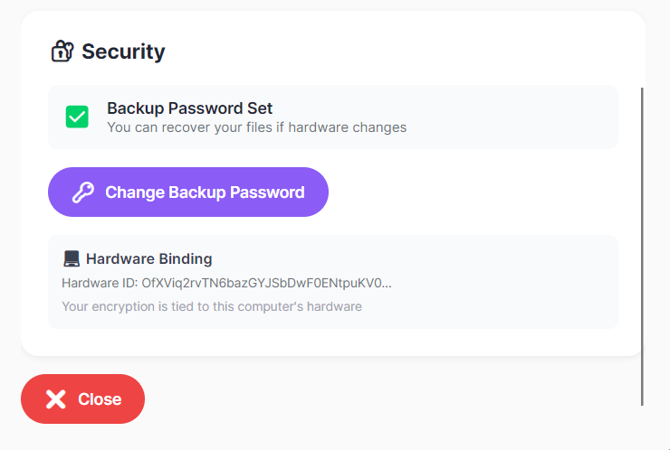
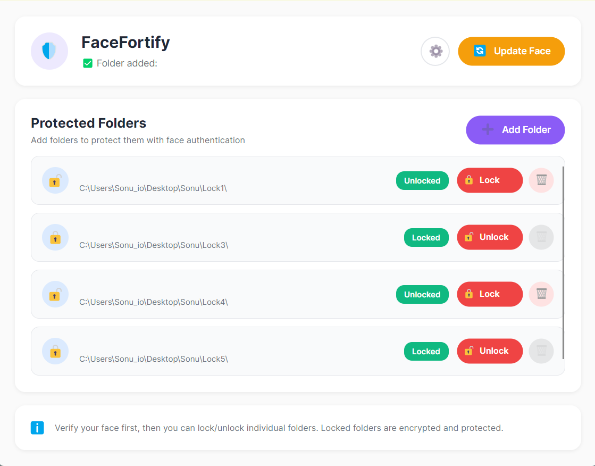
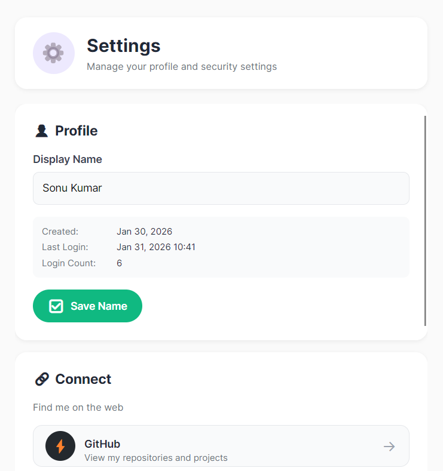

# 🔐 FaceFortify

<div align="center">

**Secure Folder Protection with Facial Recognition**

[](https://opensource.org/licenses/MIT)
[](https://dotnet.microsoft.com/)
[](https://github.com/SonuKumar-dev/FaceFortify)
[](https://learn.microsoft.com/dotnet/csharp/)
[](https://opencv.org/)
[](https://onnxruntime.ai/)
[](https://avaloniaui.net/)
[](https://en.wikipedia.org/wiki/PBKDF2)
[](https://en.wikipedia.org/wiki/Advanced_Encryption_Standard)
[](https://github.com/SonuKumar-dev/FaceFortify/releases)

*Military-grade encryption meets cutting-edge facial recognition*

[Features](#-features) • [Download](#-download) • [Documentation](#-documentation)

</div>

---

## 📖 Overview

**FaceFortify** is a cross-platform desktop application that combines **facial recognition** with **AES-256 encryption** to provide unparalleled folder security. Lock and unlock sensitive folders using your face, with optional backup password for hardware changes.

### 🎯 Key Highlights

- 🔒 **Zero-Knowledge Security** - Your face data never leaves your device
- 👤 **Advanced Face Recognition** - ArcFace ONNX model with 99%+ accuracy  
- 🔐 **Military-Grade Encryption** - AES-256 with PBKDF2 key derivation
- 💻 **True Cross-Platform** - Windows, Linux, macOS (Intel & Apple Silicon)
- 🖥️ **Native Performance** - Built with .NET 8 and Avalonia UI
- 🔄 **Hardware-Bound Keys** - Keys tied to your specific machine
- 💾 **Offline-First** - No internet connection required
- 🎨 **Modern UI** - Fluent design with smooth animations

---

## 🖼️ Application Preview

<div align="center">

### 📝 First Time Registration


### 👋 Welcome Screen


### 📷 Face Register Screen


### 🔑 Backup & Hardware Security


### 🏠 Dashboard – Manage Protected Folders


### ⚙️ Settings & Profile


</div>


## ✨ Features

### 🔐 Security Features

- **Facial Recognition Authentication**
  - Multi-frame capture for high accuracy
  - Live eye detection validation
  - Real-time feedback with visual overlays
  - Works in various lighting conditions

- **Advanced Encryption**
  - AES-256-CBC encryption
  - PBKDF2 key derivation (100,000 iterations)
  - Hardware-bound primary keys
  - Optional password-based backup keys

- **Folder Access Control**
  - Windows ACL (Access Control Lists)
  - Linux chmod + chattr (immutable flag)
  - macOS chflags (user immutable)
  - Complete file system protection

### 👤 User Experience

- **Intuitive Interface**
  - Clean, modern design
  - Easy folder management
  - One-click lock/unlock
  - Real-time status indicators

- **Smart Camera System**
  - Live face detection preview
  - Eye tracking visualization
  - Confidence score display
  - Multi-frame validation

---

## 📥 Download

### Latest Release

[**Download Latest Version**](https://github.com/SonuKumar-dev/FaceFortify/releases/latest)

### Windows

- **Installer**: `FaceFortify-Setup-1.0.0.exe` (~200 MB) - Recommended
- **Portable**: `FaceFortify-Windows-x64.zip` (~180 MB)
- **Requirements**: Windows 10+ (x64), Camera

### Linux  

- **AppImage**: `FaceFortify-Linux-x86_64.AppImage` (~200 MB)
- **Requirements**: Linux kernel 4.0+, Camera with V4L2

### macOS

- **Intel**: `FaceFortify-macOS-x64.dmg` (~190 MB)
- **Apple Silicon**: `FaceFortify-macOS-arm64.dmg` (~200 MB)
- **Requirements**: macOS 10.15+, Camera permissions

---

## 🏗️ Building from Source

### Prerequisites

- [.NET 8 SDK](https://dotnet.microsoft.com/download/dotnet/8.0)
- Git
- Camera for testing

### Quick Start

```bash
# Clone repository
git clone https://github.com/yourusername/FaceFortify.Desktop.git
cd FaceFortify.Desktop

# Restore dependencies
dotnet restore

# Build and run
dotnet build
dotnet run
```

### Required Assets

Download AI models (not included in repo due to size):

1. **ArcFace Model** - `arcface.onnx` (~4.7 MB)
   - Place in: `Assets/models/`
   - [Download from ONNX Model Zoo](https://github.com/onnx/models)

2. **Haar Cascades** - OpenCV models
   - `haarcascade_frontalface_default.xml`
   - `haarcascade_eye.xml`  
   - Place in: `Assets/models/`
   - [Download from OpenCV](https://github.com/opencv/opencv/tree/master/data/haarcascades)

### Create Distributables

**Windows:**
```cmd
build-windows-installer.bat
```
Output: `publish/windows/installer/FaceFortify-Setup-1.0.0.exe`

**Linux:**
```bash
chmod +x build-linux-with-icon.sh
./build-linux-with-icon.sh
```
Output: `publish/linux/FaceFortify-Linux-x86_64.AppImage`

**macOS:**
```bash
chmod +x build-macos-with-icon.sh
./build-macos-with-icon.sh
```
Output: `publish/macos/FaceFortify-macOS-*.dmg`

---

## 🏛️ Architecture

### Tech Stack

- **Frontend**: Avalonia UI 11.3, MVVM, ReactiveUI
- **Backend**: .NET 8.0, C#
- **AI/ML**: ONNX Runtime (ArcFace), OpenCV Sharp 4.11
- **Encryption**: AES-256-CBC, PBKDF2 (SHA-256, 100k iterations)
- **Cross-Platform**: .NET 8, Platform-specific APIs

### Project Structure

```
FaceFortify.Desktop/
├── Assets/
│   ├── Icons/              # App icons
│   └── models/             # AI models (download separately)
├── Services/               # Core business logic
│   ├── AesKeyService.cs
│   ├── ArcFaceRecognitionService.cs
│   ├── FaceAuthService.cs
│   ├── FolderLockService.cs
│   └── ...
├── ViewModels/             # MVVM view models
├── Views/                  # Avalonia XAML UI
└── build-*.sh/bat          # Build scripts
```

### Data Storage

- **Windows**: `%APPDATA%\FaceFortify`
- **Linux**: `~/.local/share/FaceFortify`
- **macOS**: `~/Library/Application Support/FaceFortify`

---

## 🛡️ Security

### What We Do

✅ Store all data locally (no cloud, no servers)  
✅ Hardware-bound encryption keys  
✅ Zero-knowledge design  
✅ Open source & auditable  
✅ Multi-factor validation (face + optional password)

### Threat Model

**Protects Against:**
- ✅ Unauthorized physical access
- ✅ Stolen hard drive/laptop
- ✅ Malware file access
- ✅ Other user accounts

**Does NOT Protect Against:**
- ❌ Keyloggers with OS-level access
- ❌ State-level adversaries
- ❌ Physical coercion
- ❌ Quantum computers (future threat)

### Best Practices

⚠️ **Set a backup password** if you might change hardware  
⚠️ **Backup important data** before encryption  
⚠️ **Use strong OS login password**  
⚠️ **Lock your computer** when away

---

## 📚 Documentation
- 📖 [Documentation](docs/README.md) - Code Algorithms 
- [Security](docs/SECURITY.md) - Security architecture
- [Contributing](CONTRIBUTING.md) - Contribution guidelines

---

## 📝 License

MIT License - see [LICENSE](LICENSE) file for details.

### Third-Party

- Avalonia UI - MIT
- OpenCV - Apache 2.0
- ONNX Runtime - MIT
- ArcFace Model - Apache 2.0

---

## 🙏 Acknowledgments

- **Avalonia Team** - Cross-platform UI framework
- **OpenCV** - Computer vision library
- **ONNX** - Model runtime
- **ArcFace Authors** - Face recognition model
- **All Contributors** - Your support matters!

---

## 📞 Support
- 🐛 [Issues](https://github.com/SonuKumar-dev/FaceFortify/issues)

**Security Issues**: Please report privately to work1.sonukumar@gmail.com

---

## 🗺️ Roadmap

### v1.1 (Planned)
- [ ] Multi-user support
- [ ] Timed auto-lock
- [ ] Cloud backup (encrypted)
- [ ] Biometric integration (Windows Hello, Touch ID)

### v2.0 (Future)
- [ ] Network folder support
- [ ] Encrypted vault
- [ ] File shredding
- [ ] Hardware key integration (YubiKey)

---

<div align="center">

**Made with ❤️ for Privacy and Security**

⭐ Star us on GitHub — it motivates us a lot!

[⬆ Back to Top](#-facefortify)

</div>
